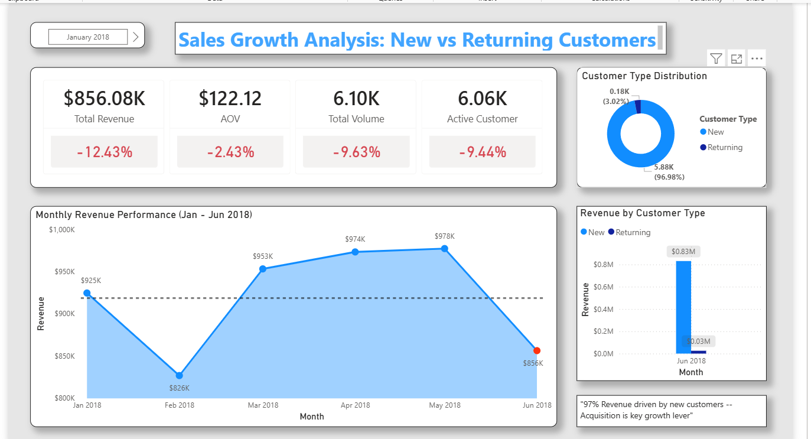

## 📉 Revenue Decline Investigation — Olist E-Commerce (2018)
SQL-based investigation to identify the root cause of a 12.4% revenue decline on the Olist e-commerce platform in June 2018.

## 📌 Background
Olist, a Brazilian e-commerce platform, experienced a significant revenue decline of 12.4% in June 2018 after three consecutive months of stable performance (March–May 2018). As a data analyst, the goal is to investigate this decline systematically — identifying whether the drop was caused by fewer transactions, lower order values, customer loss, or product performance issues — and provide actionable recommendations based on data.

## 🔍 Investigation Framework
Revenue Drop → Decompose (Volume vs AOV) → Customer Analysis → Segmentation (New vs Returning) → Product Category Investigation → Conclusion

## 📊 Key Findings
1. Revenue Trend

    Revenue was relatively stable from March to May 2018, then dropped sharply by 12.4% in June 2018. This pattern suggests a sudden event rather than a long-term     declining trend.

Revenue Decomposition

2. Revenue = Volume x AOV
    
    •    Volume Order: -9.6%
    
    •    Average Order Value (AOV): -2.4%
The revenue decline was primarily driven by a drop in transaction volume, while AOV remained relatively stable.

3. Customer Analysis

    Active customers dropped by 9.4%, consistent with the decline in order volume. This confirms that fewer customers making purchases was the main driver of the     transaction drop.

4. Customer Segmentation

   •    New Customer: -9.6%

   •    Returning Customer: -2.1%
The decline was dominated by new customers. It is worth noting that the Olist dataset structurally has very few returning customers, so changes in that segment are naturally minimal.

5. Product Category Investigation

    The decline occurred evenly across almost all product categories — no single category experienced a dominant drop. This eliminates the possibility that the        revenue decline was caused by a specific product’s performance.

## 💡 Key Insight
The revenue decline in June 2018 was most likely caused by a problem in customer acquisition, not product or category performance.

## ✅ Recommendation
The Olist marketing team should investigate why new customer numbers dropped in June 2018. Since the decline happened across all product categories, the issue is likely related to how new customers are being acquired, not what they are buying. Further data on acquisition channels would be needed to confirm this.

## 🛠️ Data Validation
•    Checked for price anomalies in the order_item table

•    Verified that all delivered orders have at least one item

•    Validated customer_unique_id to avoid duplication in customer growth calculations

•    Cross-checked total revenue after join against raw data (identical result: 13,221,498.11)

## 📊 Dashboard Preview

## 📂 File Structure
SQL_File/ — main queries and validation queries

README.md — project documentation

##🔧 Tools Used
SQL — PostgreSQL
Visualization — Power BI
